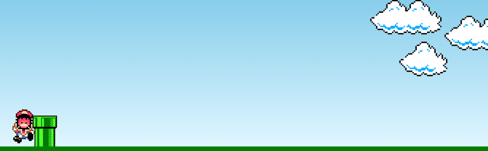
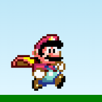
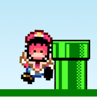

<div align="center">
  <h1>Mario-Run 🎮</h1>
</div>


<p align="center">
  
</p>

## 💻 Projeto

**Mario-Run** é um jogo simples criado com **JavaScript**, onde você deve ajudar o Mario a pular obstáculos enquanto corre. O objetivo é evitar os obstáculos tocando a tecla **espaço** para pular. Se Mario bater em um obstáculo, o jogo reinicia, e ele "morre". O projeto foca na **manipulação do DOM** com animações e interatividade utilizando apenas HTML, CSS e JavaScript.

## 🚀 Tecnologias

- **HTML**
- **CSS**
- **JavaScript (DOM Manipulation)**

## 📔 Conhecimentos abordados

- [x] Manipulação de DOM com JavaScript
- [x] Animações com GIFs e transições
- [x] Criação de interação de jogo simples (clicar para pular)
- [x] Manipulação de elementos visuais (GIFs, imagens, etc.)
- [x] Controle de fluxo do jogo (início, fim e reinício)

## 📱 Como jogar

1. Abra o projeto em um navegador.
2. Mario começa a correr automaticamente.
3. Clique na tecla **espaço** para fazer Mario pular e evitar os obstáculos.
4. Se Mario colidir com o obstáculo, o jogo pode ser reiniciado.

## 🎮 Objetivo do projeto

O objetivo deste projeto é demonstrar o uso de manipulação de DOM em um ambiente interativo e divertido, com animações e interação do usuário. Ele serve como um exemplo prático de como podemos usar JavaScript para criar jogos simples no navegador.

## 🎨 Imagens & Animações

- **Imagem do Mario correndo**:
  <p align="left">
    
  </p>

- **Imagem do Mario morto**:
  <p align="left">
    
  </p>

## 📦 Como rodar o projeto

1. Clone o repositório.
   ```bash
   git clone https://github.com/seu-usuario/mario-run.git

2. Abra o arquivo index.html em um navegador de sua escolha.

## 📬 Contato

Em caso de dúvidas ou sugestões, entre em contato:

- **Email**: devgabrielsilveira@gmail.com
- **LinkedIn**: https://www.linkedin.com/in/gabriel-silveira-67979b18a/

Desenvolvido por Gabriel Silveira 🚀
